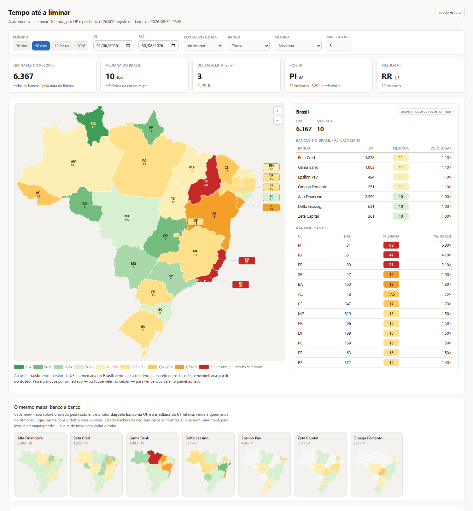
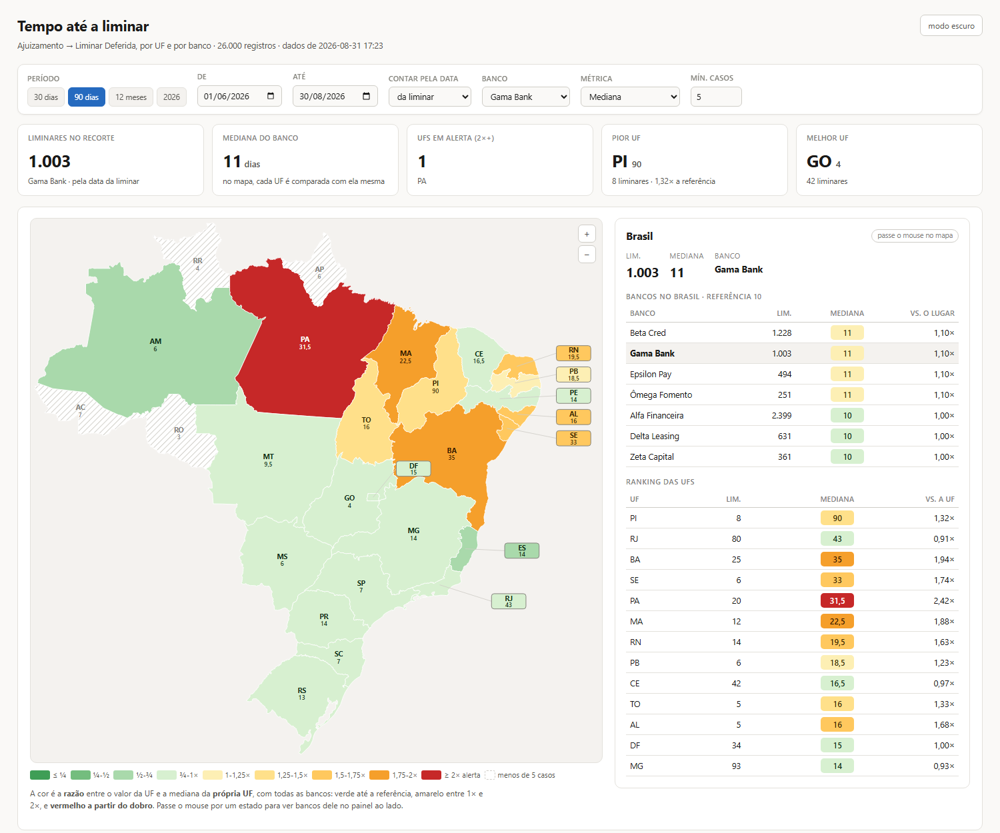

# Mapa de calor do Brasil por UF

Gera **um único arquivo `.html`** sem servidor, sem CDN, sem `node_modules` com um mapa
coroplético interativo do Brasil, um painel que acompanha o cursor (ou o toque) e um mini-mapa
por categoria.
A entrada é um CSV de cinco colunas.

**▶ [Abrir a demonstração ao vivo](https://theusilva.github.io/mapa-uf-brasil/)** o mapa abaixo,
funcionando, com dados sintéticos. Passe o mouse pelos estados — ou toque neles, no celular.



```bash
git clone <este-repo> && cd mapa-uf-brasil
npm start          # gera dados sintéticos e constrói site/mapa.html
```

---

## O problema que ele resolve

Um mapa pintado pelo valor absoluto responde *"onde é alto?"*. Quase sempre a pergunta útil é
outra: **"onde está fora do ritmo?"** e as duas dão mapas diferentes.

Compare os dois recortes abaixo. No primeiro, o país inteiro; no segundo, uma única categoria.
O Norte e o Nordeste acendem **não porque são lentos** (o mapa geral mostra que não são), mas
porque *aquela* categoria demora ali o dobro do que todo mundo demora no mesmo lugar. Uma média
nacional por categoria esconderia isso: ela sai perto do normal, porque o problema é local.



---

## A régua de cor

A cor sai da **razão entre o valor e uma referência**, nunca do valor absoluto. São nove faixas:
verde até a referência, amarelo entre 1× e 2×, **vermelho a partir do dobro**.

| situação | a referência de cada UF é |
|---|---|
| todas as categorias | a mediana do **Brasil** |
| uma categoria escolhida | a mediana da **própria UF**, com todas as categorias |

A segunda linha é o coração da coisa: com uma categoria escolhida, cada estado é comparado
**consigo mesmo**. É o que separa "esta transportadora é lenta" de "esta transportadora é lenta
*aqui*".

Três consequências, todas assumidas de propósito:

- **O mesmo número pode sair verde num estado e vermelho em outro.** Por isso o número fica
  sempre escrito dentro do estado: a cor reforça a leitura, nunca é a única fonte dela.
- **Duas telas com filtros diferentes não se comparam pela cor**, só pelo número.
- **Célula com poucos casos não recebe cor nenhuma** e a referência também exige o mínimo.
  Colorir contra um número frouxo é pior que não colorir. Essas linhas ficam esmaecidas no
  painel em vez de sumir, senão some também o motivo de elas não estarem no ranking.

Há uma quarta métrica, *"% dentro de N"*, que é a **única em que maior é melhor**. Quando ela
está ativa, três coisas viram junto: a régua (que passa a ser absoluta, ancorada num alvo), o
sentido da ordenação e o parágrafo que explica a cor.

---

## A entrada

CSV separado por `;`, em UTF-8, com cabeçalho. A ordem das colunas não importa, o nome sim:

| coluna | o que é |
|---|---|
| `UF` | sigla de 2 letras |
| `LOCAL` | município, comarca, filial — o nível abaixo da UF |
| `CATEGORIA` | o que se compara **dentro** da UF: banco, transportadora, produto, equipe |
| `DT_INICIO` | `AAAA-MM-DD` |
| `DT_FIM` | `AAAA-MM-DD` |

O valor medido é a distância em dias entre as duas datas. Linha começando com `--` é ignorada
(muito extrator carimba um comentário no topo do arquivo).

```bash
node src/gera-mapa.js meus-dados.csv site/meu-mapa.html
```

O gerador reclama alto do que descartou linha com número de campos diferente do cabeçalho,
data fora do formato, `DT_FIM` anterior a `DT_INICIO`. Descarte silencioso é como um recorte
errado sobrevive meses.

## O vocabulário

O motor não sabe do que você está falando. O `config.json` troca as palavras da tela:

```json
{
  "titulo": "Tempo até a liminar",
  "entidade": "Banco", "entidades": "Bancos",
  "local": "Comarca", "locais": "Comarcas",
  "fato": "liminares", "unidade": "dias",
  "todos": "todos os bancos", "doArtigo": "do banco",
  "meta": { "limite": 18, "alvo": 95 }
}
```

`todos` e `doArtigo` existem porque português tem gênero: concatenar `"todas as " + entidade`
produz *"todas as bancos"*.

---

## Decisões de desenho que valem explicação

**As oito UFs pequenas ganham etiqueta fora do mapa.** O DF tem 327 unidades de área contra
83.078 do Amazonas rótulo dentro do polígono só funciona onde cabe. DF, SE, AL, RJ, ES, PB,
RN e PE recebem uma etiqueta ligada por uma linha fina. A etiqueta tem contorno próprio: a do
DF cai sobre os vizinhos, que caem na mesma faixa de cor que ela com frequência, e sem contorno
ela desaparecia no fundo.

**A geometria existe uma vez só.** Os 27 caminhos ficam num `<defs>` e todo mundo referencia com
`<use>`. Repetir o `d` de 27 polígonos em 12 mini-mapas seriam ~150 mil pontos no DOM.

**Os rótulos não crescem com o zoom.** Eles ficam dentro do grupo da câmera com `scale(1/k)`, o
que anula a escala: um "SP" de 14px viraria 84px em 6×.

**O pacote leva uma linha por registro, não agregados.** Mediana não se agrega a tela recalcula
a cada combinação de filtro. As datas viajam como inteiros (dias desde uma âncora) e os índices
em base 36, o que mantém um CSV de 26 mil linhas em ~460 KB de HTML.

**O filtro de categoria não entra na agregação.** Se o recorte já viesse filtrado, a referência
seria a própria categoria e toda UF sairia em 1,00× o mapa ficaria uniformemente verde e
pareceria estar funcionando.

---

## Os testes

```bash
npm run teste
```

Um arreio de DOM mínimo (`vm.runInContext` + stubs de `document`/`window`) executa **o mesmo
script que vai para a página**, sem navegador. Não pega layout; pega o que importa: régua de
cor, referência, ordenação e principalmente **os rótulos**.

Isso não é zelo excessivo. Os defeitos mais caros deste projeto não foram de cálculo, foram de
rótulo: escolher uma categoria mudava a referência da tabela, e o cabeçalho continuava dizendo
"vs. Brasil" enquanto media contra a UF. **Número certo com legenda errada parece certo**, e é o
pior tipo de defeito de painel ninguém desconfia. Cada um desses virou um teste.

O último bloco é ponta a ponta: a base de demonstração planta um padrão conhecido (uma categoria
2,5× mais lenta em sete estados e normal no resto), e o teste exige que ele apareça no mapa
e que **não** apareça nos estados onde não foi plantado.

## A malha

`dados/br-uf-paths.json` já vem no repositório, gerado a partir do
[serviço de malhas territoriais do IBGE](https://servicodados.ibge.gov.br/api/docs/malhas),
qualidade intermediária, projetado em Mercator e simplificado por distância. Para regerar:

```bash
npm run malha            # ou: node scripts/baixa-malha.js minima
```

O script confere sozinho se a projeção não saiu espelhada: o extremo oeste tem de ser o AC, o
leste AL/RN/PB, o norte RR e o sul RS.

## Dados

**Nada neste repositório veio de base real.** `scripts/gera-demo.js` inventa tudo a partir de um
gerador determinístico mesma semente, mesmo arquivo. O `.gitignore` bloqueia `*.csv` por
padrão: a entrada natural deste tipo de projeto é extração de produção, e um `git add .`
distraído basta para publicá-la.

## Licença

MIT — veja [LICENSE](LICENSE). A malha territorial é do IBGE.
